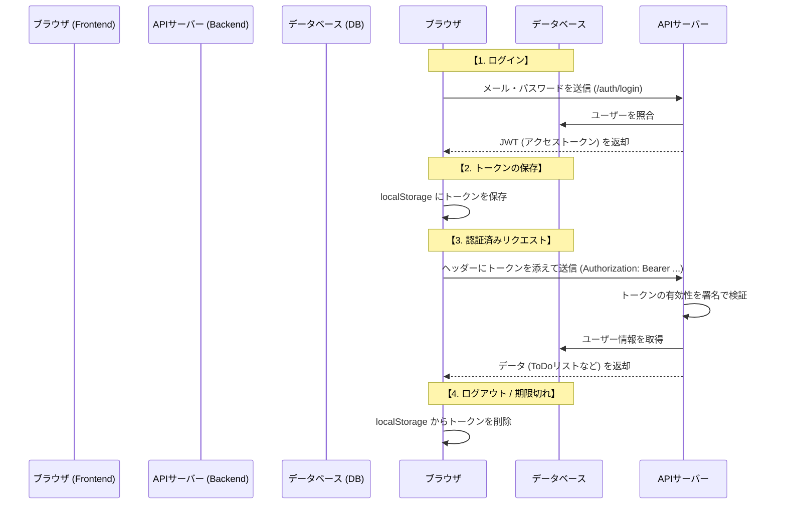

# 認証フローの解説 (Authentication Flow Guide)

このプロジェクトにおけるユーザー認証（サインアップ、ログイン、リクエストの認可）の仕組みを解説します。
このアプリでは、**JWT (JSON Web Token)** を使用したステートレスな認証方式を採用しています。

---

## 1. 認証の全体シーケンス



---

## 2. 実装の詳細

### ① ログイン・トークン発行 (Backend)
*   **エンドポイント**: `POST /auth/login`
*   **コード**: `backend/app/routers/auth.py`
*   **処理**: 
    1.  送られてきたメールアドレスとパスワードを照合。
    2.  認証成功後、`backend/app/auth.py` の `create_access_token` を呼び出し。
    3.  サーバー内の `SECRET_KEY` を用いて、ユーザー識別子（email）を含む署名付き JWT を生成。
    4.  有効期限（デフォルト60分）を設定してブラウザに返却。

### ② トークンの管理と自動送信 (Frontend)
*   **コード**: `frontend/src/api.ts`
*   **保存**: ログイン成功時、`saveToken` 関数で `localStorage` にトークンを書き込みます。
*   **自動付与**: Axios の **インターセプター (Interceptors)** 機能を使用しています。
    ```typescript
    api.interceptors.request.use((config) => {
      const token = localStorage.getItem("auth_token");
      if (token) {
        config.headers.Authorization = `Bearer ${token}`;
      }
      return config;
    });
    ```
    これにより、各API関数（`getTodos` など）を呼び出す際に、開発者が意識することなくトークンが送信されます。

### ③ サーバー側での認可 (Backend)
*   **コード**: `backend/app/auth.py` の `get_current_user`
*   **処理**: FastAPI の `Depends` 機能により、保護されたエンドポイントの実行前に以下のチェックが自動で走ります。
    1.  リクエストヘッダーからトークンを抽出。
    2.  `jwt.decode` で署名を検証（偽造や改ざんがあればここで弾かれる）。
    3.  有効期限をチェック。
    4.  中身の `email` を使って DB からユーザー情報を引き出す。

### ④ 期限切れと強制ログアウト (Frontend)
*   **コード**: `frontend/src/api.ts` の `getTodos` 等のエラーハンドリング
*   **処理**: サーバーが `401 Unauthorized`（認証切れ）を返した場合、フロント側で `clearToken()` を実行し、保存されている古いトークンを破棄します。これにより、次回のリクエスト時にログイン画面へリダイレクトされるようになります。

---

## 3. セキュリティ上の配慮

-   **パスワードハッシュ化**: パスワードは `passlib` (bcrypt) を使い、ハッシュ化した状態で DB に保存されています。
-   **暗号署名**: トークンは `SECRET_KEY` で署名されているため、サーバー以外が中身を改ざんすることは不可能です。
-   **レート制限 (Rate Limiting)**: `slowapi` を導入し、 `/auth/login` への過剰なアクセスを制限してブルートフォース攻撃を防いでいます。
-   **環境変数管理**: 署名用の鍵は環境変数 `SECRET_KEY` で管理し、本番環境でデフォルト値（CHANGE_ME）が使われないようバリデーションを行っています。
