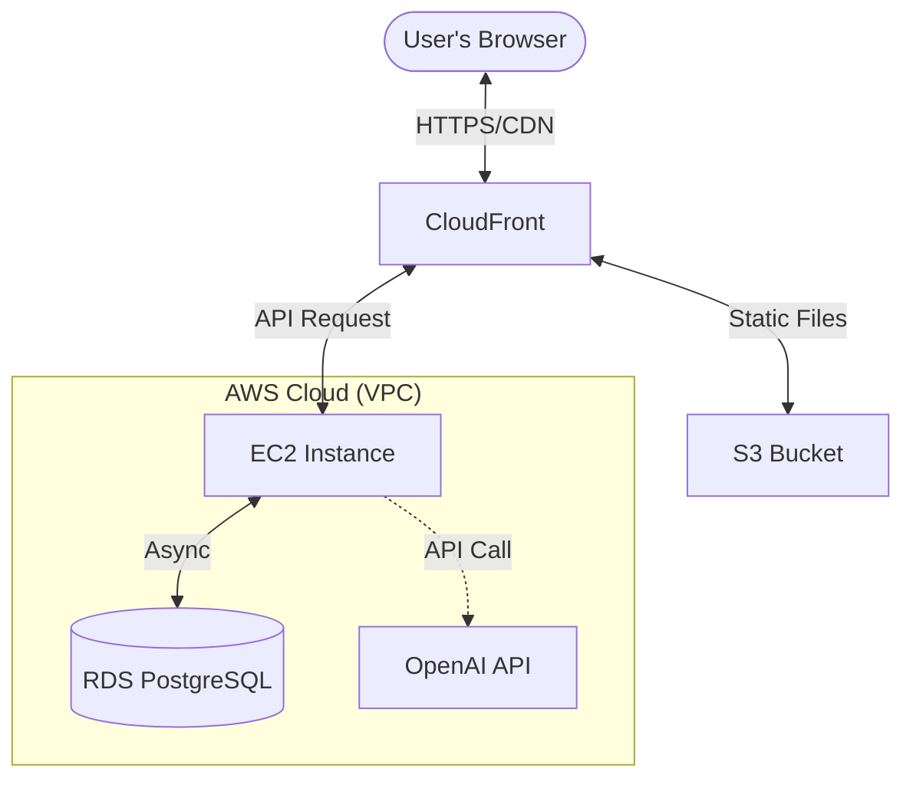

# 🚀 Modern AI-Powered ToDo App

[](https://github.com/rtiak-ops/251025/actions/workflows/ci.yml)
[](https://opensource.org/licenses/MIT)
[](https://fastapi.tiangolo.com/)
[](https://reactjs.org/)
[](https://www.terraform.io/)


**「AIアシスタント搭載 × 実務レベルのエンジニアリング」**

最新のLLM（大規模言語モデル）機能を統合しつつ、運用・保守・セキュリティといったプロフェッショナルな品質基準を満たすように設計された、次世代のWebアプリケーションです。

---

## 📋 目次
- [✨ 主な機能](#-主な機能)
- [🏗️ アーキテクチャ](#-アーキテクチャ)
- [🛠️ 技術スタック](#️-技術スタック)
- [🚀 クイックスタート](#-クイックスタート)
- [⚙️ 設定 (Environment Variables)](#️-設定-environment-variables)
- [🧪 開発・テスト](#-開発テスト)
- [🌐 デプロイ (Infrastructure as Code)](#-デプロイ-infrastructure-as-code)
- [📂 ディレクトリ構成](#-ディレクトリ構成)

---

## ✨ 主な機能

### 🧠 Magic Breakdown (AIタスク分解)
「旅行の計画」「プレゼンの準備」といった漠然としたタスクを入力し、**「✨AI分解」ボタン**を押すだけで、AIが実行可能な具体的なサブタスクを生成・追加します。

- **モックモード搭載**: OpenAI APIキー未設定でも、自動的にモックモードで動作するため、コストを気にせずUXを体験可能。
- **インテリジェント提案**: APIキー設定時は GPT-3.5/4 がリアルタイムでタスクを構造化。

### 💎 リッチなUI/UX
- **直感的なドラッグ＆ドロップ**: `React Beautiful DnD` によるスムーズな並び替え。
- **楽観的UI更新 (Optimistic Updates)**: `TanStack Query` により、通信完了を待たずにUIが反応。
- **モダンなフィードバック**: スケルトンローディングと `react-hot-toast` による洗練された通知。

### 🛡️ 生産準備完了 (Production Ready)
- **セキュリティ**: レート制限 (`slowapi`)、セキュリティヘッダー、CORSの適切な設定。
- **可観測性**: `python-json-logger` による構造化ログ。
- **堅牢性**: SQLAlchemy (Async) による非同期DBアクセスと、疎結合なレイヤー設計。

---

## 🏗️ アーキテクチャ



---

## 🛠️ 技術スタック

| Category | Technology | Usage |
|---|---|---|
| **Frontend** | React, TypeScript, Vite | 型安全な高速ビルド・開発環境 |
| **State Mgmt** | TanStack Query | サーバー状態管理・キャッシュ・楽観的更新 |
| **Backend** | Python 3.12+, FastAPI | 非同期ASGIフレームワーク |
| **Database** | PostgreSQL 17 | 本番用データ永続化 |
| **AI / LLM** | OpenAI API | タスク分解エンジン (gpt-3.5-turbo) |
| **Styling** | Tailwind CSS | ユーティリティファーストなCSS |
| **Infra (IaC)** | Terraform | VPC, EC2, RDS, S3, CloudFrontのコード化 |
| **CI/CD** | GitHub Actions | 自動テスト・ビルド・セキュリティスキャン |

---

## 🚀 クイックスタート

Dockerがあれば、最小限の手順でフルスタック環境が立ち上がります。

```bash
# 1. クローン
git clone https://github.com/rtiak-ops/251025.git
cd 251025

# 2. 設定ファイルの準備
cp .env.example .env

# 3. 起動
docker compose up --build
```

- **Webアプリ**: [http://localhost:5173](http://localhost:5173)
- **APIドキュメント**: [http://localhost:8000/docs](http://localhost:8000/docs)

---

## ⚙️ 設定 (Environment Variables)

`.env` ファイルで以下の主要な項目を設定可能です。

| 変数名 | 説明 | デフォルト値 / 例 |
|---|---|---|
| `OPENAI_API_KEY` | OpenAI APIキー (未設定時はモック動作) | `sk-...` |
| `DATABASE_URL` | DB接続用URL (SQLAlchemy形式) | `postgresql+asyncpg://...` |
| `SECRET_KEY` | JWT署名用の秘密鍵 | (ランダムな文字列を推奨) |
| `ENV` | 実行環境モード | `development` / `production` |
| `CORS_ORIGINS` | 接続を許可するオリジン | `http://localhost:5173` |

---

## 🧪 開発・テスト

### ✅ バックエンド (pytest)
```bash
docker compose exec backend pytest -v --cov=app
```

### ✅ フロントエンド (Vitest)
```bash
cd frontend && npm install && npm run test
```

### 🔄 マイグレーション (Alembic)
```bash
docker compose exec backend alembic upgrade head
```

---

## 🌐 デプロイ (Infrastructure as Code)

本プロジェクトは AWS へのデプロイを Terraform で自動化しています。

1. **ディレクトリ移動**: `cd terraform`
2. **要件**: AWS CLI, Terraform がインストールされていること。
3. **実行**: 
   ```bash
   terraform init
   terraform apply
   ```

手動のデプロイ手順は以下のガイドを参照してください：
- [📖 AWS デプロイ全体像](memo/EC2_DEPLOAY_PLAN.md)
- [📖 S3/CloudFront フロントエンドデプロイ](memo/S3_CLOUDFRONT_GUIDE.md)
- [📖 RDS 移行・管理ガイド](memo/RDS_MIGRATION_GUIDE.md)

---

## 📂 ディレクトリ構成

```text
.
├── backend/             # FastAPI アプリケーション
│   ├── app/             # アプリ本体 (Routers, Models, Schemas)
│   ├── tests/           # バックエンドテストコード
│   └── alembic/         # DBマイグレーション履歴
├── frontend/            # React + Vite アプリケーション
│   ├── src/             # ソースコード (Components, Hooks, API)
│   └── public/          # 静的アセット
├── terraform/           # AWS インフラ定義 (IaC)
├── .github/workflows/   # GitHub Actions (CI/CD)
├── memo/                # 設計ドキュメント・各種ガイド
└── docker-compose.yml   # 開発環境コンテナ定義
```

---

**Developed by rtiak-ops**  
*Quality and Speed, combined with AI potential.*

