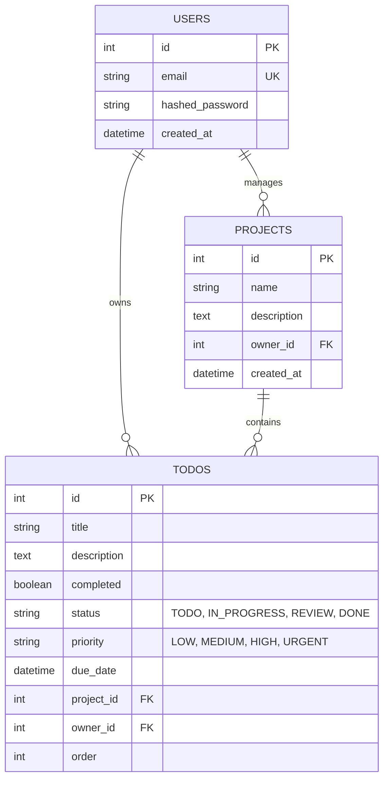

# 🚀 BizFlow: Enterprise AI Task Management Platform

[](https://github.com/rtiak-ops/251025/actions/workflows/ci.yml)
[](https://github.com/rtiak-ops/251025/security/code-scanning)
[](https://opensource.org/licenses/MIT)
[](https://fastapi.tiangolo.com/)
[](https://reactjs.org/)
[](https://www.terraform.io/)

<table align="center">
  <tr>
    <td align="center" width="50%">
      <br>
      <sub>プレミアム認証インターフェース</sub>
    </td>
    <td align="center" width="50%">
      <br>
      <sub>インテリジェント・プロジェクトダッシュボード</sub>
    </td>
  </tr>
</table>

## 🌟 プロジェクト概要

**BizFlow** は、単なるタスク管理を超えた、**「実務の複雑さに耐えうるプロフェッショナルなタスクプラットフォーム」**です。
プロジェクト管理、ビジネスワークフロー、そして最新のLLM（大規模言語モデル）によるタスク分解機能を統合しました。

ビジネス現場で求められる「優先順位の可視化」「プロジェクト横断の進捗管理」「AIによる業務の細分化」を、グラスモーフィズムを採用したプレミアムなUXで実現しています。

## 📋 目次
- [✨ 主要なビジネス機能](#-主要なビジネス機能)
- [🏗️ システムアーキテクチャ](#️-システムアーキテクチャ)
- [📊 データベース設計 (ER図)](#-データベース設計-er図)
- [🎬 主要なシーケンス (Core Workflows)](#-主要なシーケンス-core-workflows)
- [💡 解決した技術的課題](#-解決した技術的課題)
- [🛠️ 技術スタック](#️-技術スタック)
- [🚀 セットアップガイド](#-セットアップガイド)
    - [1. 🏠 ローカル開発環境 (Docker)](#1--ローカル開発環境-docker)
    - [2. ☁️ クラウド展開 (AWS/Terraform)](#2--クラウド展開-awsterraform)

---

## ✨ 主要なビジネス機能

### 1. 📊 インテリジェント・ダッシュボード
全体のタスク進捗、プロジェクトごとの達成率、緊急タスクの警告を一目で把握可能。
- **達成率の可視化**: プロジェクトごとの進捗を動的なプログレスバーで表示。
- **緊急アラート**: 優先度が「至急(URGENT)」のタスクが残っている場合に自動で通知。

### 2. 📁 プロジェクト・階層管理
タスクをプロジェクト単位で整理し、業務の境界を明確にします。
- **プロジェクト横断表示**: すべてのタスクを俯瞰するビューと、プロジェクトに特化したビューを即座に切り替え。
- **動的なフォルダ機能**: サイドバーから直感的にプロジェクトを作成・管理。

### 3. 🚦 ビジネス・ワークフロー
現場の運用に即したタスク情報の管理を実現。
- **4段階の優先度**: `LOW`, `MEDIUM`, `HIGH`, `URGENT` によるフィルタリング。
- **ライフサイクル管理**: `未着手` → `進行中` → `レビュー` → `完了` のステータス遷移。
- **期限管理**: 期限付きタスクを視覚的に強調。

### 4. 🧠 AIタスク分解 (GenAI Integration)
「大きな課題」を「実行可能なステップ」に。
- **AI分解**: 入力された抽象的なタスクを、Google Gemini APIを活用して具体化・細分化。
- **シームレスな登録**: 分解されたサブタスクを、現在のプロジェクト配下に一括で自動登録。

---

## 🏗️ システムアーキテクチャ

可用性とスケーラビリティを考慮し、AWSのマネージドサービスをフル活用したアーキテクチャを採用しています。

```mermaid
graph TD
    User([User's Browser]) <-->|HTTPS/CDN| CF[CloudFront]
    CF <-->|Static Files| S3[S3 Bucket]
    CF <-->|API Request| EC2[EC2 Instance / FastAPI]
    
    subgraph "AWS Cloud (Managed VPC)"
        EC2 <-->|RDS Connection| RDS[(RDS PostgreSQL)]
        EC2 -.->|JSON Logs| CW[CloudWatch]
        EC2 -.->|External API| AI[Gemini / OpenAI API]
    end

    subgraph "DevOps Ecosystem"
        GA[GitHub Actions] -->|Terraform Plan/Apply| AWS[AWS Infrastructure]
        GA -->|Build & Test| App[Application Code]
    end
```



---

## 📊 データベース設計 (ER図)

ビジネス要件に対応した、リレーショナルなデータ構造を採用しています。



---

## 🔥 独自のエンジニアリング・ポイント

### 1. ⚡ 楽観的UI更新 (Optimistic UI)
**TanStack Query** を活用し、並び替えやステータス更新を「待ち時間ゼロ」で反映。APIのレスポンスを待たずにUIを先行更新することで、デスクトップアプリのような操作感を提供。

### 2. 🛡️ セキュリティ・バイ・デザイン
- **認証**: JWT + HttpOnly Cookie (推奨) / Authorization Header によるセキュアな認証。
- **スキャン**: **Trivy** によるコンテナ/依存関係の脆弱性スキャンをGitHub Actionsで常時実施。
- **インフラ**: TerraformによるVPC/セキュリティグループの厳密な定義。

### 3. 🎨 プレミアムUX
- **グラスモーフィズム**: 半透明のぼかし効果を多用した最新のUIデザイン。
- **ダークモード同期**: OSの設定やユーザーの好みに合わせたスムーズなテーマ切り替え。

---

## 🛠️ 技術スタック

| カテゴリ | 技術 |
|---|---|
| **Frontend** | React 19, TypeScript, **Lucide-React**, Tailwind CSS |
| **Backend** | Python 3.13, FastAPI, **SQLAlchemy (Async)** |
| **Logic** | TanStack Query, React Hook Form |
| **Database** | PostgreSQL 17, Alembic (Migration) |
| **Infra/DevOps** | AWS, Terraform, GitHub Actions, Docker |
| **AI** | **Google Gemini Pro / Flash**, OpenAI API |

---

## 🚀 セットアップガイド

### 1. 🏠 ローカル開発環境 (Docker)
最も手軽に環境を構築できる方法です。

```bash
git clone https://github.com/rtiak-ops/251025.git
cd 251025
cp .env.example .env
# .envにGOOGLE_API_KEYなどを設定（任意）
docker compose up --build
```
- **App**: [http://localhost](http://localhost)
- **API Docs**: [http://localhost:8000/docs](http://localhost:8000/docs)

### 2. ☁️ クラウド展開 (AWS/Terraform)
AWS上に本番環境を自動構築し、GitHub Actionsによる継続的デプロイ（CD）を有効化します。

#### ① AWS 認証の設定
AWS SSOを使用して、ローカル端末からAWSを操作可能にします。
```bash
aws sso login
```

#### ② インフラの構築 (Terraform)
`terraform` ディレクトリに移動し、インフラを作成します。
```bash
cd terraform
# 初期化
terraform init
# 構築の実行 (変数の入力が求められます)
terraform apply
```

#### ③ GitHub Secrets の設定
GitHubのリポジトリ設定（Settings > Secrets and variables > Actions）に以下の値を登録することで、自動デプロイが開始されます。

| Secret Key | 説明 |
|---|---|
| `AWS_ROLE_ARN` | Terraform実行後に出力された `github_actions_role_arn` |
| `APP_SECRET_KEY` | JWT認証用の秘密鍵（32文字以上のランダムな文字列） |
| `DB_PASSWORD` | RDSのマスターパスワード |
| `EC2_SSH_KEY` | EC2接続用の秘密鍵 (PEM形式) |
| `EC2_USER` | `ec2-user` か `ubuntu` (AMIに依存) |
| `EC2_HOST` | EC2のパブリックIP（動的取得に失敗する場合の予備） |
| `GOOGLE_API_KEY` | Gemini APIキー |

#### ④ デプロイ
`main` または `develop` ブランチにコードを `push` すると、自動的にフロントエンド（S3/CloudFront）とバックエンド（EC2/Docker）が更新されます。

---

## 📖 詳細ドキュメント
- [🔐 認証フローの徹底解説](AUTH_FLOW.md)
- [📘 コードリーディング・ガイド](CODE_READING_GUIDE.md)

---
**Developed by [rtiak-ops]**  
*Enterprise Scale. AI Native. Professional Quality.*
