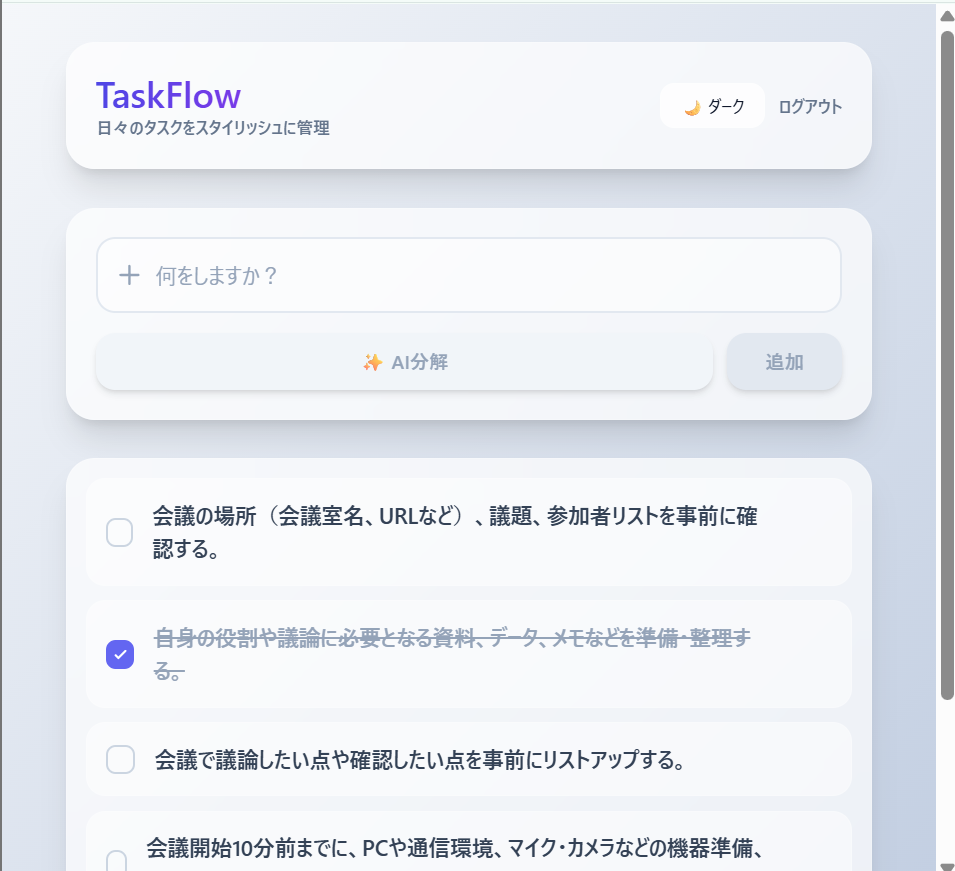
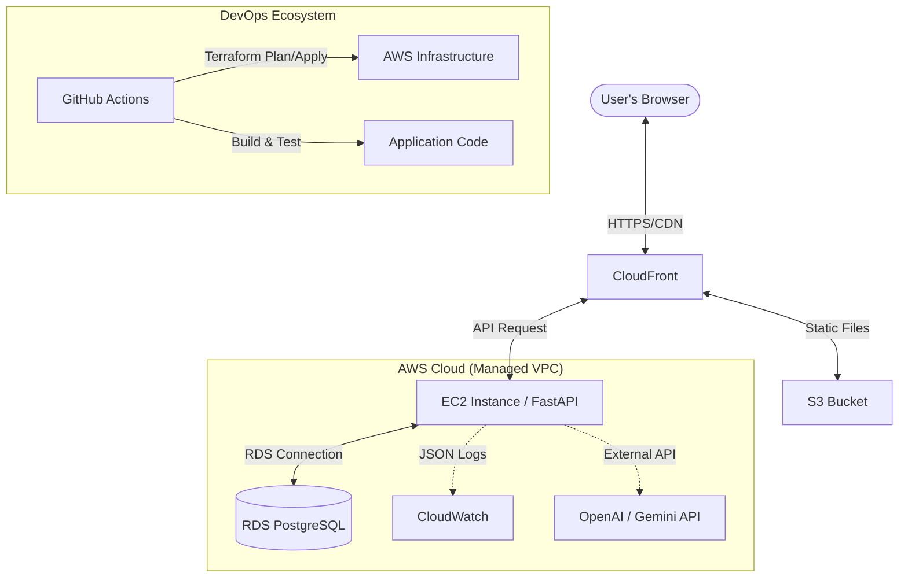
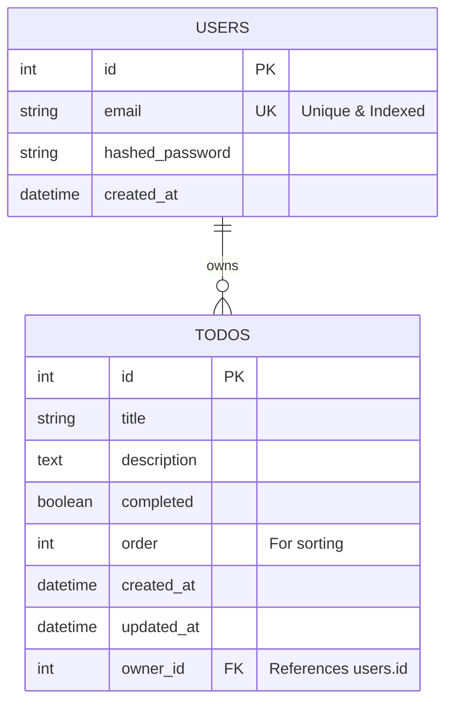
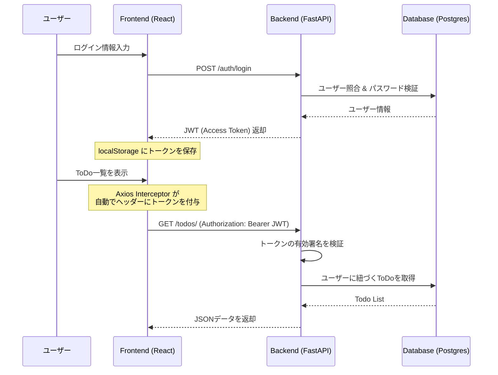
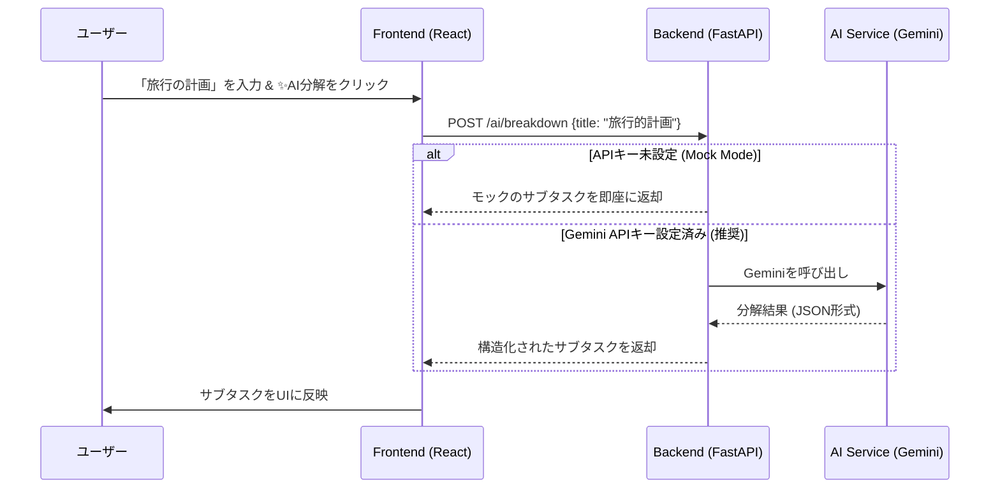
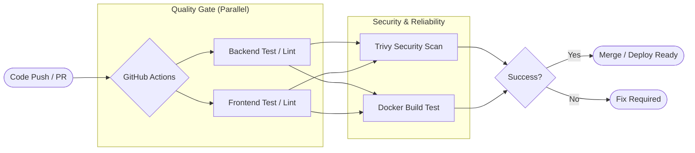

# 🚀 Modern AI-Powered ToDo App

[](https://github.com/rtiak-ops/251025/actions/workflows/ci.yml)
[](https://github.com/rtiak-ops/251025/security/code-scanning)
[](https://opensource.org/licenses/MIT)
[](https://fastapi.tiangolo.com/)
[](https://reactjs.org/)
[](https://www.terraform.io/)

<table align="center">
  <tr>
    <td align="center" width="50%">
      <br>
      <sub>認証ページ</sub>
    </td>
    <td align="center" width="50%">
      <br>
      <sub>「10時に会議」と入力後、AIがタスクを構造化して提案する</sub>
    </td>
  </tr>
</table>

## 🌟 プロジェクト概要

このプロジェクトは、単なるToDo管理アプリではありません。**「実務で通用する品質のWebアプリケーションを、最新のAI技術とDevOps環境で提供する」**ことを目的としたポートフォリオ作品です。

React (Frontend) + FastAPI (Backend) のモダンな構成に加え、Terraform によるインフラのコード化 (IaC)、GitHub Actions による高度な CI/CD パイプライン、そして LLM を活用した独自の「AI分解」機能を統合しています。

## 📋 目次
- [🏗️ システムアーキテクチャ](#️-システムアーキテクチャ)
- [📊 データベース設計 (ER図)](#-データベース設計-er図)
- [🎬 主要なシーケンス (Core Workflows)](#-主要なシーケンス-core-workflows)
- [💡 解決した技術的課題](#-解決した技術的課題)
- [🧪 品質保証とテスト戦略](#-品質保証とテスト戦略)
- [🔥 独自のエンジニアリング・ポイント](#-独自のエンジニアリング・ポイント)
- [🛠️ 技術スタックと選定理由](#️-技術スタックと選定理由)
- [🚀 セットアップガイド](#-セットアップガイド)

---

## 🏗️ システムアーキテクチャ

可用性とスケーラビリティを考慮し、AWSのマネージドサービスをフル活用したアーキテクチャを採用しています。



---

## 📊 データベース設計 (ER図)

拡張性と整合性を重視したシンプルなスキーマ構成です。



---

## 🎬 主要なシーケンス (Core Workflows)

アプリケーションの主要な動作フローを可視化しています。

### 1. 認証 & 認可フロー
JWTを使用したステートレスな認証と、APIインターセプターによる自動トークン付与の仕組みです。



### 2. AIタスク分解
ユーザーの入力に基づき、LLMがタスクを構造化して提案するフローです。



### 3. CI/CD パイプライン
GitHub Actions を活用した、テスト・ビルド・セキュリティチェックの自動化フローです。



---

## 🔥 独自のエンジニアリング・ポイント

### 1. 🧠 AIタスク分解
「何をすべきか分からない」という課題をLLMが解決します。
- **AIサポート**: Google Gemini API (2.5 Flash/3.0 Flash) に対応。環境変数に基づいて動的に切り替わります。
- **効率的なプロンプト設計**: コンテキストを絞り込み、実行可能なサブタスクを構造化して返却。
- **フォールバック設計**: APIキー未設定時は自動でモックモードへ移行し、UXを損なわない設計。

### 2. ⚡ 高度な状態管理と楽観的更新
- **TanStack Query (React Query)** を使用し、サーバーデータのキャッシュと同期を最適化。
- **Optimistic Updates**: タスクの追加や削除時に、サーバーの応答を待たずにUIを即座に更新。通信遅延を感じさせないスムーズな操作感を実現。

### 3. 🛡️ 生産準備完了 (Production Ready) なセキュリティ
- **認証/認可**: JWT (JSON Web Token) を用いたステートレス認証。パスワードは bcrypt (passlib) でハッシュ化。
- **防御的エンジニアリング**: `slowapi` によるレート制限、適切なCORS、セキュリティヘッダーの設定。
- **脆弱性診断**: CIプロセスにて **Trivy** による静的スキャンを常時実行。

### 4. 🚀 徹底した CI/CD と IaC
- **Infrastructure as Code**: Terraform により、ネットワーク(VPC)から計算資源、DBまでを完全にコードで管理。
- **オートメーション**:
    - 全てのプルリクエストに対し、自動で Linter, UnitTest (pytest/vitest) を実行。
    - Dockerイメージのビルド検証とセキュリティスキャンをパスしたコードのみがデプロイ対象。

---

## 💡 解決した技術的課題 (Technical Challenges)

### 1. AIレスポンスの遅延とユーザー体験の不一致
- **課題**: Gemini APIのレスポンスには数秒〜10秒程度の時間を要し、その間ユーザーが「操作不能」と感じる懸念があった。
- **解決策**:
    - **楽観的更新 (Optimistic Updates)**: タスク追加時にサーバーの応答を待たずにUI側で仮のアイテムを表示。
    - **非同期ストリーミング/スケルトン表示**: AI分解中であることを示す専用のスケルトンUIを導入し、心理的な待ち時間を軽減。

### 2. インフラ環境の「再現性」と「可観測性」
- **課題**: 手動デプロイによる設定漏れや、環境ごとの差異がトラブルの原因になっていた。
- **解決策**:
    - **Terraformのフル活用**: 全リソースをIaC化し、`terraform apply` 一発で本番同等の環境を再現可能に。
    - **構造化ログ**: `python-json-logger` を導入し、CloudWatch等でのログ解析を容易にするJSON形式のログを出力するように設計。

---

## 🧪 品質保証とテスト戦略 (Quality Assurance)

「品質は工程で作り込む」という考えに基づき、以下のテスト戦略を導入しています。

### 1. 多層的なテストスイート
- **Backend (pytest)**:
    - ユニットテスト: CRUDロジック、認証/認可スタックの検証。
    - 結合テスト: テスト用DBを使用したエンドポイントの正常系・異常系検証。
- **Frontend (vitest / React Testing Library)**:
    - コンポーネントテスト: UI要素が正しくレンダリングされ、イベントが発火するかを検証。
    - フックテスト: カスタムフック（API通信ロジック等）の動作検証。

### 2. CIパイプラインによる継続的品質管理
- **自動実行**: 全てのプルリクエストに対し、GitHub Actions上でテストが自動実行。
- **セキュリティ・スキャン**: **Trivy** による依存ライブラリの脆弱性診断をパイプラインに組み込み、既知の脆弱性を含むコードがマージされるのを防止。

---

## 🛠️ 技術スタックと選定理由

| カテゴリ | 技術 | 選定理由 |
|---|---|---|
| **Frontend** | React 19, TypeScript | 型安全性の確保と、エコシステムの広さによるメンテナンス性を重視。 |
| **State Mgmt** | TanStack Query | ローカルの状態とサーバーデータの同期をシンプルに、かつ高度に制御するため。 |
| **Backend** | Python 3.13, FastAPI | 非同期処理 (asyncio) のネイティブサポートによる高パフォーマンスと開発速度の両立。 |
| **Database** | PostgreSQL 17 | 信頼性と柔軟な JSON 処理能力、実務での採用実績を考慮。 |
| **Infra (IaC)** | Terraform | マルチクラウドにも対応可能な汎用性と、HCLによる構成の可読性を重視。 |
| **CI/CD** | GitHub Actions | GitHubリポジトリとの密結合による開発ワークフローの最適化。 |

---

## 📂 ディレクトリ構成

```text
.
├── backend/             # FastAPI サーバー
│   ├── app/             # ビジネスロジック, Models, Schemas
│   ├── tests/           # pytest による高いテストカバレッジの維持
│   └── alembic/         # データベーススキーマ管理（マイグレーション）
├── frontend/            # React + Vite
│   ├── src/             # TypeScript によるコンポーネント設計
│   └── public/          # 静的アセット
├── terraform/           # AWS インフラ定義 (VPC, EC2, RDS, S3, CF)
├── .github/workflows/   # CI/CD パイプライン (Test, Lint, Security, Build)
└── memo/                # 詳細なドキュメント (Auth, RDS, Deployなど)
```

---

## 🚀 セットアップガイド

### 1. 🏠 ローカル開発環境 (Docker)

Dockerを使用することで、データベース、バックエンド、フロントエンドを一度に起動できます。最も推奨される方法です。

```bash
# 1. リポジトリのクローン
git clone https://github.com/rtiak-ops/251025.git
cd 251025

# 2. 環境変数の準備
cp .env.example .env
# ※ .env を開き、SECRET_KEY や Google/OpenAI の APIキーを設定してください。
# ※ 未設定でもモックモードで動作可能です。

# 3. コンテナのビルドと起動
docker compose up --build
```

- **フロントエンド**: [http://localhost](http://localhost)
- **バックエンドAPI**: [http://localhost:8000/docs](http://localhost:8000/docs) (Swagger UI)

---

### 2. ☁️ クラウド環境の構築 (AWS / Terraform)

Terraformを使用して、AWS上に拡張性の高い本番環境を自動構築します。

#### **インフラの構築手順**
```bash
cd terraform

# 1. 初期化
terraform init

#（再ログイン時）   
＃時間が空いた場合、AWSに再ログイン。
aws sso login
＃実行するとブラウザが立ち上がり、認証を許可する。

# 2. 実行計画の確認
terraform plan

# 3. リソースの作成
terraform apply
```
※ 構築完了後、CloudFrontのURLが出力されます。

#### **⚠️ インフラを再構築（destroy & apply）する場合の注意点**
`terraform destroy` を実行して環境を一度削除し、再度 `apply` する場合は、以下の点に注意してください。

1.  **データの喪失**: 
データベース（RDS）やファイル（S3）の内容はすべて削除されます。

2.  **GitHub Secrets の更新**: 
インフラが新しくなると、IPアドレス（`EC2_HOST`）や CloudFront ID、S3バケット名が変わる可能性があります。
GitHubリポジトリの `Settings > Secrets and variables > Actions` に以下の環境変数を登録してください。
terraform outputで値を確認可能。

・EC2_HOST: インスタンスが新しくなるため、パブリックIPアドレスが変わります。
・CLOUDFRONT_DISTRIBUTION_ID: ディストリビューションが再作成されるとIDが新しくなります。
・S3_BUCKET_NAME: バケット名にランダムな要素を含ませている場合、名前が変わる可能性があります。

3.  **アプリの再デプロイ**: 
再構築直後の S3 は空の状態です。
GitHub に適当な空コミットなどをプッシュして自動デプロイを走らせるか、
手動でビルド・アップロードを行うまで画面は表示されません。

4.  **デプロイ状況の監視**
GitHub の [Actions] タブを開きます。
「CI/CD Pipeline」が走り始めているので、完了するまで待ちます。
deploy ジョブが緑色になれば成功です。

---


## 📖 詳細ドキュメント

より深くエンジニアリングの詳細を知りたい方は、以下のドキュメントを参照してください。
- [🔐 認証フローの徹底解説](AUTH_FLOW.md)
- [📘 コードリーディング・ガイド](CODE_READING_GUIDE.md)
- [☁️ AWSデプロイ戦略](memo/EC2_DEPLOY_PLAN.md)

---

## 📈 今後のロードマップ
- [ ] マルチテナント対応（組織・チーム機能）
- [ ] WebSocket によるリアルタイム通知
- [ ] AWS 各リソースの監視 (CloudWatch Alarm) の追加
- [ ] モバイルアプリ (React Native) への展開

---
**Developed by [rtiak-ops]**  
*Code with passion, Deploy with confidence.*
