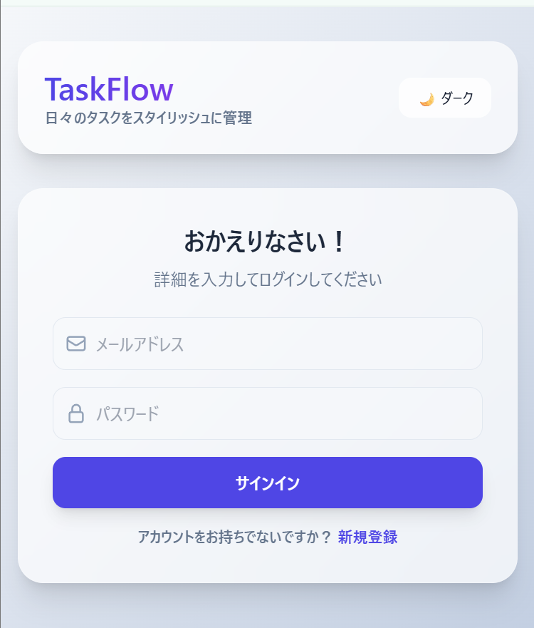
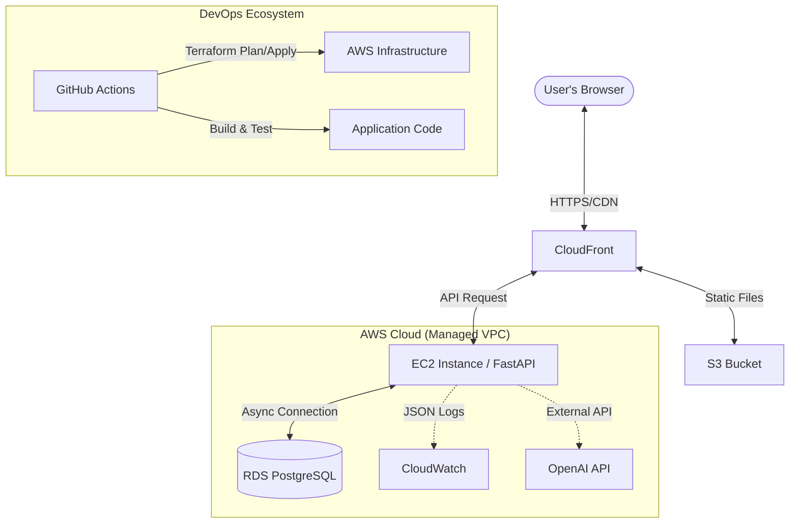
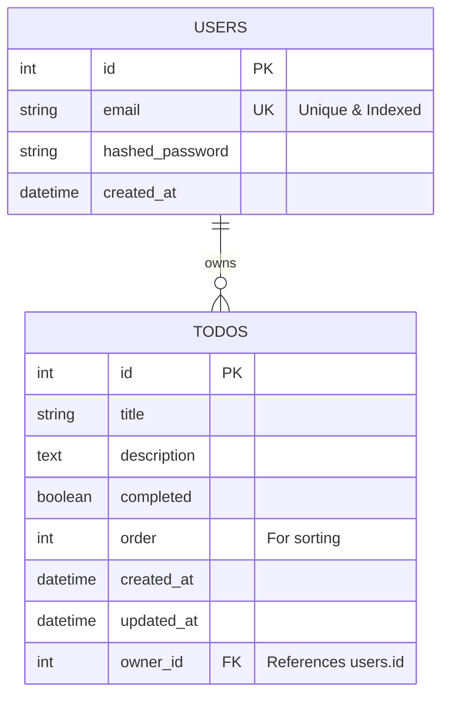
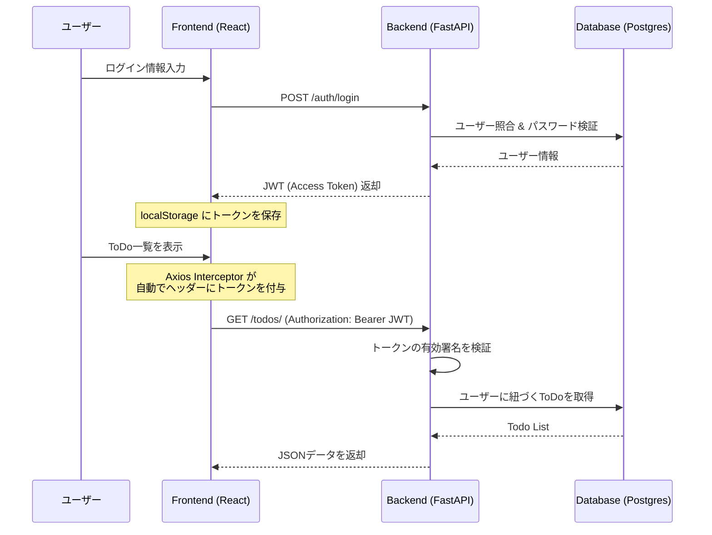
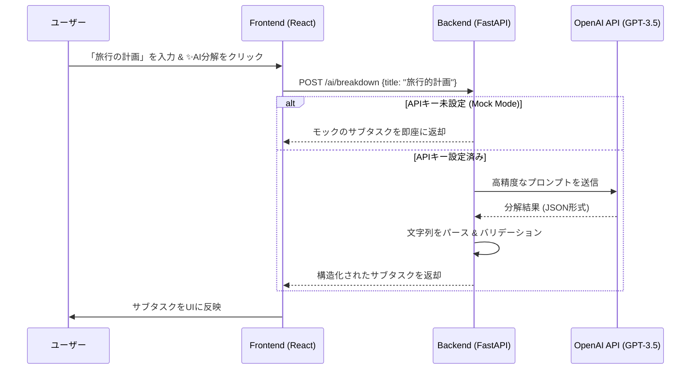

# 🚀 Modern AI-Powered ToDo App

[](https://github.com/rtiak-ops/251025/actions/workflows/ci.yml)
[](https://github.com/rtiak-ops/251025/security/code-scanning)
[](https://opensource.org/licenses/MIT)
[](https://fastapi.tiangolo.com/)
[](https://reactjs.org/)
[](https://www.terraform.io/)

<div align="center">
  
  <p><em>「AIアシスタント搭載 × 本格的なエンジニアリング・プラクティスの実践」</em></p>
</div>

## 🌟 プロジェクト概要

このプロジェクトは、単なるToDo管理アプリではありません。**「実務で通用する品質のWebアプリケーションを、最新のAI技術とDevOps環境で提供する」**ことを目的としたポートフォリオ作品です。

React (Frontend) + FastAPI (Backend) のモダンな構成に加え、Terraform によるインフラのコード化 (IaC)、GitHub Actions による高度な CI/CD パイプライン、そして LLM を活用した独自の「Magic Breakdown」機能を統合しています。

## 📋 目次
- [🏗️ システムアーキテクチャ](#️-システムアーキテクチャ)
- [📊 データベース設計 (ER図)](#-データベース設計-er図)
- [🎬 主要なシーケンス (Core Workflows)](#-主要なシーケンス-core-workflows)
- [💡 解決した技術的課題](#-解決した技術的課題)
- [🧪 品質保証とテスト戦略](#-品質保証とテスト戦略)
- [🔥 独自のエンジニアリング・ポイント](#-独自のエンジニアリング・ポイント)
- [🛠️ 技術スタックと選定理由](#️-技術スタックと選定理由)
- [🚀 クイックスタート](#-クイックスタート)

---

## 🏗️ システムアーキテクチャ

可用性とスケーラビリティを考慮し、AWSのマネージドサービスをフル活用したアーキテクチャを採用しています。



---

## 📊 データベース設計 (ER図)

拡張性と整合性を重視したシンプルなスキーマ構成です。



---

## 🎬 主要なシーケンス (Core Workflows)

アプリケーションの主要な動作フローを可視化しています。

### 1. 認証 & 認可フロー
JWTを使用したステートレスな認証と、APIインターセプターによる自動トークン付与の仕組みです。



### 2. Magic Breakdown (AIタスク分解)
ユーザーの入力に基づき、LLMがタスクを構造化して提案するフローです。



---

## 🔥 独自のエンジニアリング・ポイント

### 1. 🧠 Magic Breakdown (AIタスク分解)
「何をすべきか分からない」という課題をLLMが解決します。
- **効率的なプロンプト設計**: コンテキストを絞り込み、実行可能なサブタスクを構造化して返却。
- **フォールバック設計**: APIキー未設定時は自動でモックモードへ移行し、UXを損なわない設計。

### 2. ⚡ 高度な状態管理と楽観的更新
- **TanStack Query (React Query)** を使用し、サーバーデータのキャッシュと同期を最適化。
- **Optimistic Updates**: タスクの追加や削除時に、サーバーの応答を待たずにUIを即座に更新。通信遅延を感じさせないスムーズな操作感を実現。

### 3. 🛡️ 生産準備完了 (Production Ready) なセキュリティ
- **認証/認可**: JWT (JSON Web Token) を用いたステートレス認証。パスワードは bcrypt (passlib) でハッシュ化。
- **防御的エンジニアリング**: `slowapi` によるレート制限、適切なCORS、セキュリティヘッダーの設定。
- **脆弱性診断**: CIプロセスにて **Trivy** による静的スキャンを常時実行。

### 4. 🚀 徹底した CI/CD と IaC
- **Infrastructure as Code**: Terraform により、ネットワーク(VPC)から計算資源、DBまでを完全にコードで管理。
- **オートメーション**:
    - 全てのプルリクエストに対し、自動で Linter, UnitTest (pytest/vitest) を実行。
    - Dockerイメージのビルド検証とセキュリティスキャンをパスしたコードのみがデプロイ対象。

---

## 💡 解決した技術的課題 (Technical Challenges)

### 1. AIレスポンスの遅延とユーザー体験の不一致
- **課題**: OpenAI APIのレスポンスには数秒〜10秒程度の時間を要し、その間ユーザーが「操作不能」と感じる懸念があった。
- **解決策**:
    - **楽観的更新 (Optimistic Updates)**: タスク追加時にサーバーの応答を待たずにUI側で仮のアイテムを表示。
    - **非同期ストリーミング/スケルトン表示**: AI分解中であることを示す専用のスケルトンUIを導入し、心理的な待ち時間を軽減。

### 2. インフラ環境の「再現性」と「可観測性」
- **課題**: 手動デプロイによる設定漏れや、環境ごとの差異がトラブルの原因になっていた。
- **解決策**:
    - **Terraformのフル活用**: 全リソースをIaC化し、`terraform apply` 一発で本番同等の環境を再現可能に。
    - **構造化ログ**: `python-json-logger` を導入し、CloudWatch等でのログ解析を容易にするJSON形式のログを出力するように設計。

---

## 🧪 品質保証とテスト戦略 (Quality Assurance)

「品質は工程で作り込む」という考えに基づき、以下のテスト戦略を導入しています。

### 1. 多層的なテストスイート
- **Backend (pytest)**:
    - ユニットテスト: CRUDロジック、認証/認可スタックの検証。
    - 結合テスト: テスト用DBを使用したエンドポイントの正常系・異常系検証。
- **Frontend (vitest / React Testing Library)**:
    - コンポーネントテスト: UI要素が正しくレンダリングされ、イベントが発火するかを検証。
    - フックテスト: カスタムフック（API通信ロジック等）の動作検証。

### 2. CIパイプラインによる継続的品質管理
- **自動実行**: 全てのプルリクエストに対し、GitHub Actions上でテストが自動実行。
- **セキュリティ・スキャン**: **Trivy** による依存ライブラリの脆弱性診断をパイプラインに組み込み、既知の脆弱性を含むコードがマージされるのを防止。

---

## 🛠️ 技術スタックと選定理由

| カテゴリ | 技術 | 選定理由 |
|---|---|---|
| **Frontend** | React 18, TypeScript | 型安全性の確保と、エコシステムの広さによるメンテナンス性を重視。 |
| **State Mgmt** | TanStack Query | ローカルの状態とサーバーデータの同期をシンプルに、かつ高度に制御するため。 |
| **Backend** | Python 3.12+, FastAPI | 非同期処理 (asyncio) のネイティブサポートによる高パフォーマンスと開発速度の両立。 |
| **Database** | PostgreSQL 17 | 信頼性と柔軟な JSON 処理能力、実務での採用実績を考慮。 |
| **Infra (IaC)** | Terraform | マルチクラウドにも対応可能な汎用性と、HCLによる構成の可読性を重視。 |
| **CI/CD** | GitHub Actions | GitHubリポジトリとの密結合による開発ワークフローの最適化。 |

---

## 📂 ディレクトリ構成

```text
.
├── backend/             # FastAPI サーバー
│   ├── app/             # ビジネスロジック, Models, Schemas
│   ├── tests/           # pytest による高いテストカバレッジの維持
│   └── alembic/         # データベーススキーマ管理（マイグレーション）
├── frontend/            # React + Vite
│   ├── src/             # TypeScript によるコンポーネント設計
│   └── public/          # 静的アセット
├── terraform/           # AWS インフラ定義 (VPC, EC2, RDS, S3, CF)
├── .github/workflows/   # CI/CD パイプライン (Test, Lint, Security, Build)
└── memo/                # 詳細なドキュメント (Auth, RDS, Deployなど)
```

---

## 🚀 クイックスタート

Docker を使用して、ローカルにフルスタック環境を数分で構築できます。

```bash
# 1. リポジトリのクローン
git clone https://github.com/rtiak-ops/251025.git
cd 251025

# 2. 環境設定（必要に応じて OpenAI キーを設定）
cp .env.example .env

# 3. コンテナの起動
docker compose up --build
```

- **Frontend**: [http://localhost:5173](http://localhost:5173)
- **Backend API**: [http://localhost:8000/docs](http://localhost:8000/docs) (Swagger UI)

---

## 📖 詳細ドキュメント

より深くエンジニアリングの詳細を知りたい方は、以下のドキュメントを参照してください。
- [🔐 認証フローの徹底解説](AUTH_FLOW.md)
- [📘 コードリーディング・ガイド](CODE_READING_GUIDE.md)
- [☁️ AWSデプロイ戦略](memo/EC2_DEPLOY_PLAN.md)

---

## 📈 今後のロードマップ
- [ ] マルチテナント対応（組織・チーム機能）
- [ ] WebSocket によるリアルタイム通知
- [ ] AWS 各リソースの監視 (CloudWatch Alarm) の追加
- [ ] モバイルアプリ (React Native) への展開

---
**Developed by [rtiak-ops]**  
*Code with passion, Deploy with confidence.*
