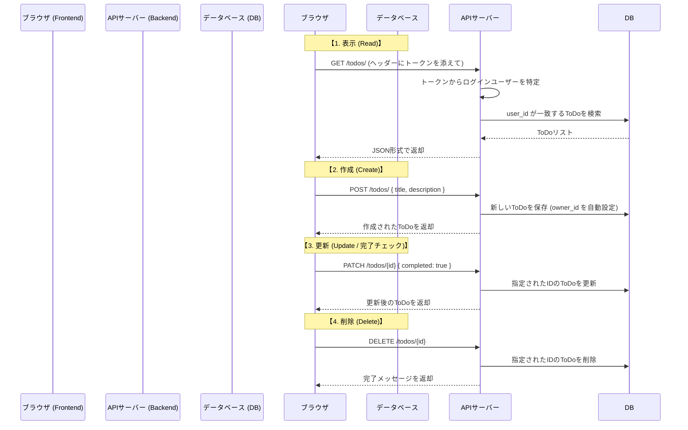

# ToDo処理の流れ (ToDo Flow Guide)

このプロジェクトにおけるToDoアイテムの作成、表示、更新、削除（CRUD）の流れを解説します。

---

## 1. 処理の全体シーケンス

---

## 2. 実装の詳細

### ① ToDoの取得 (`GET /todos/`)
*   **関わり**: `frontend/src/api.ts` の `getTodos` → `backend/app/routers/todos.py` の `read_todos`
*   **ポイント**: 
    - リクエスト時に `Authorization` ヘッダーが自動的に付与されます。
    - サーバー側では「誰のリクエストか」を判断し、**他人のToDoが見えないように** DB クエリでフィルタリングしています。

### ② ToDoの作成 (`POST /todos/`)
*   **関わり**: `frontend/src/api.ts` の `createTodo` → `backend/app/routers/todos.py` の `create_todo`
*   **ポイント**: 
    - フロントエンドから送るのは `title` と `description` だけです。
    - 誰のToDoか（`owner_id`）は、サーバー側でトークンから解析されたユーザーIDが自動的に割り振られます。

### ③ ToDoの更新・完了切り替え (`PATCH /todos/{id}`)
*   **関わり**: `frontend/src/api.ts` の `updateTodo` → `backend/app/routers/todos.py` の `update_todo`
*   **ポイント**: 
    - 全部を書き換えるのではなく、変更したい部分だけを送る「部分更新（PATCH）」を採用しています。
    - チェックボックスのON/OFF（`completed`）もこれで行います。

### ④ ドラッグ＆ドロップによる並び替え (`POST /todos/reorder`)
*   **関わり**: `frontend/src/api.ts` の `reorderTodos` → `backend/app/routers/todos.py` の `reorder_todos`
*   **ポイント**: 
    - 画面で入れ替えた後の ID の並び順（配列）をそのままサーバーに送り、DB の `order_index` を一括更新します。

---

## 3. 安心・安全のための仕組み

-   **所有権のチェック**: すべての操作（特に更新と削除）において、サーバー側で「操作しようとしているToDoが本当にそのユーザーのものか」を毎回チェックしています。これにより、IDを直接指定して他人のタスクを操作するような攻撃を防いでいます。
-   **バリデーション**: `Pydantic` というライブラリ（`schemas.py`）により、空のタイトルや不正な形式のデータが送られてきた場合に、DBに触れる前にエラーとして弾いています。
