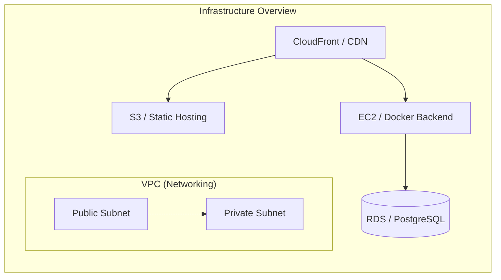

# 🏗️ Infrastructure as Code (Terraform)

このディレクトリには、Modern AI-Powered ToDo App を AWS 上にデプロイするための全インフラ定義が含まれています。  
Terraform を使用することで、一貫性のある環境構築と安全なリソース管理を実現しています。

---

## 📐 インフラアーキテクチャ

本プロジェクトでは、可用性とセキュリティを重視したマルチレイヤー構成を採用しています。



### 🔐 主要なセキュリティ機能
- **CloudFront OAC (Origin Access Control)**: S3 バケットを公開せずに、CloudFront からのみ安全にアクセス可能。
- **最小権限の IAM**: GitHub Actions 用の OIDC ロールにより、永続的なアクセスキーを使わずにデプロイ可能。
- **分離されたネットワーク**: データベース (RDS) はパブリックアクセス不可のプライベートサブネットに配置。

---

## 🛠️ プロビジョニングされるリソース

| 分類 | リソース | 役割 |
| :--- | :--- | :--- |
| **Network** | `vpc.tf` | VPC, サブネット, IGW, ルートテーブルの定義 |
| **Compute** | `ec2.tf` | Backend 用の EC2 インスタンス (Docker 導入済み) |
| **Storage** | `s3.tf` | Frontend の静的ファイルホスティング用バケット |
| **Database** | `rds.tf` | PostgreSQL 17 (マネージドデータベース) |
| **CDN** | `cloudfront.tf` | 高速配信および API 向き付け用 CloudFront 分配 |
| **Security** | `iam.tf`, `sg.tf` | IAM ロール, ポリシー, セキュリティグループの一括管理 |

---

## 🚀 使用方法

### 1. 前準備 (Prerequisites)

- [Terraform](https://www.terraform.io/downloads.html) (v1.0.0+)
- [AWS CLI](https://aws.amazon.com/cli/) (設定済みであること)
- AWS アカウントの権限

### 2. 環境変数の設定

`terraform.tfvars.example` をコピーして、実際の値を入力してください。

```bash
cp terraform.tfvars.example terraform.tfvars
```

> [!IMPORTANT]  
> `db_password` は推測されにくい強力なものを設定してください。

### 3. デプロイ手順

```bash
# ディレクトリ移動
cd terraform

# プロバイダーの初期化
terraform init

#（再ログイン時）   
＃時間が空いた場合、AWSに再ログイン。
aws sso login
＃実行するとブラウザが立ち上がり、認証を許可する。

# 変更内容の確認
terraform plan

# リソースの作成
terraform apply
```
Apply complete!　で成功。

### 4. リソースの削除
```bash
terraform destroy
```
---

## 📝 管理上の注意点

- **SSHキー**: インスタンスへのアクセスには `variables.tf` で指定された既存の `key_name` が必要です。
- **State管理**: 現在はローカルでのステート管理設定になっています。チーム開発では S3 バックエンド等の導入を検討してください。
- **コストについて**: 本構成は AWS 無料枠を最大限活用するように設計されていますが、RDS や CloudFront の使用量によっては課金が発生する場合があります。不要になったら `terraform destroy` で削除してください。

---

**Built with Precision by rtiak-ops**
